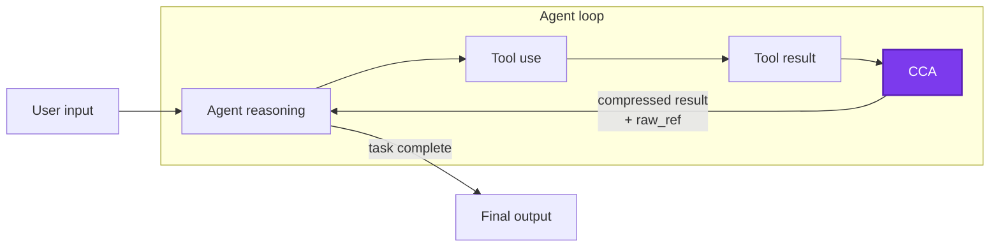
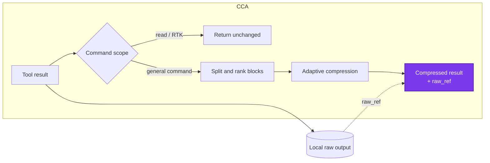

# Command Compressor for Agent

Command Compressor for Agent (`CCA`) saves tokens with rules instead of asking the Agent to “use fewer tokens.”

CCA supports Claude Code, Codex, stable OpenCode, and Pi. It is compatible with [RTK](https://github.com/rtk-ai/rtk): RTK takes over common commands and optimizes their output, while CCA removes low-value information after a command has run.

中文说明见 [docs/README.zh-CN.md](docs/README.zh-CN.md).

## 1. What CCA Does

Long build logs, package installation output, progress bars, and repeated status lines can consume a large part of an agent's context without helping it solve the task. CCA compresses those low-value regions while preserving errors, tracebacks, source locations, encoded data, visual diagnostics, and other information that is unsafe to guess away.

CCA is deliberately small:

- **Restrained.** It does not take over commands or wrap the Agent; it only compresses output after a command finishes.
- **Local.** No network calls, model calls, embeddings, or runtime learning.
- **Recoverable.** Every changed result has a local `raw_ref`; the original command is not rerun to recover omitted text.
- **Read-safe and RTK-compatible.** Inspection commands, raw fallback reads, and RTK-managed commands pass through unchanged.
- **Fail-open.** If an adapter or compressor fails, the agent receives the original Tool Result.

### Install

CCA requires Node.js 18 or later.

```bash
npm install -g @linger-alpha/cca
cca init --global
```

`cca init` detects installed supported agents and installs every applicable integration. To install only one integration:

```bash
cca install --claude-code --global
cca install --codex --global
cca install --opencode --global
cca install --pi --global
```

Use `--project` instead of `--global` for a repository-local installation.

```bash
cca status --json       # detection, installation paths, and trust state
cca gain                # local estimated savings
cca rules               # active editable rule file
cca uninstall --global  # remove all CCA-managed global integrations
```

Codex requires the user to review its hook in `/hooks`; CCA does not bypass that trust step. Codex presents post-tool replacement through blocked hook feedback even though the command has already completed, so CCA explicitly tells the model that the text is a compressed result rather than a command failure. OpenCode v2 beta is not supported by this release.

## 2. How CCA Works

CCA sits inside the normal Agent loop, between command execution and the next model turn:



Inside that single CCA step:



First, command policy exempts inspection, raw fallback, and RTK-managed commands. For other commands, a linear rule-based splitter groups adjacent lines using blank regions, timestamps, log levels, traceback state, indentation, and repetition changes. It does not parse a specific test framework or ask a model what the text means.

Each block is then assigned one of three actions:

- **Preserve:** keep encoded or binary-looking data, visual and dense-semantic output, tracebacks, failures, and high-value diagnostics losslessly.
- **Light:** collapse duplicates and retain useful head, tail, and critical lines.
- **Strong:** remove progress noise and aggressively fold repetitive, low-information output.

Finally, each Agent adapter replaces the platform-specific Tool Result. The agent only sees that the result was compressed and where the original is stored; internal scores, tiers, and rule diagnostics are never added to its context. Claude Code uses `updatedToolOutput`, Codex uses post-tool blocked feedback, OpenCode updates `tool.execute.after`, and Pi replaces `tool_result.content` while preserving `details` and `isError`.

The rules are static JSON. Offline TACO-inspired research can propose and judge new candidates, but no training code or model dependency is shipped in the npm package.

## 3. Experimental Results

### Experiment setup

| Setting | Value |
| --- | --- |
| Benchmark | `terminal-bench/terminal-bench-2-1@latest`, with task revisions recorded by checksum |
| Tasks | `build-cython-ext`, `pypi-server`, `sqlite-with-gcov`, `log-summary-date-ranges`, `regex-log`, `nginx-request-logging`, `extract-elf`, `sqlite-db-truncate`, `code-from-image`, and `count-dataset-tokens` |
| Agent | Codex CLI running through Harbor in isolated Docker task environments |
| Model | `gpt-5.6-luna`, `max` reasoning effort |
| Dynamic arms | No compression vs CCA 0.2.0-rc.1 (`00e82fa`) |
| Repetitions | Four per task and arm: 10 tasks × 4 repeats × 2 arms = 80 valid trials |
| Trial order | Randomized with seed `20260729`; the seed controls ordering, not model determinism |
| Execution | The first 37 valid trials ran sequentially; the remaining 43 ran with two workers after validating isolated state updates |
| Retry policy | Three setup attempts affected by transient apt-mirror EOF errors were retried and excluded from the 80 valid task results |

The end-to-end input counts below are reported by Codex over the complete, changing Agent trajectory. The fixed-input tables instead use CCA's local token estimator on captured Tool Results. They answer different questions and should not be compared as if they were the same metric.

### Same input: raw output vs 0.1.4 vs 0.2.0-rc.2

The fixed-input comparison takes all 523 Tool Results captured from the 40 no-compression trials and deterministically replays them as raw output, through CCA 0.1.4 (`7830b17`), and through the post-experiment 0.2.0-rc.2 rules. This isolates compressor behavior from Agent trajectory variation. Token counts are local estimates, not provider billing figures.

| Compressor | Estimated Tool Result tokens | Reduction vs raw | Reduction vs 0.1.4 |
| --- | ---: | ---: | ---: |
| No compression | 398,555 | — | — |
| CCA 0.1.4 | 373,320 | 6.33% | — |
| CCA 0.2.0-rc.2 | 343,646 | **13.78%** | **7.95%** |

When read-only, RTK, and fallback passthroughs are excluded, the 342 general-command results show the difference more clearly:

| Compressor | Estimated tokens | Reduction vs raw | Reduction vs 0.1.4 |
| --- | ---: | ---: | ---: |
| No compression | 164,762 | — | — |
| CCA 0.1.4 | 153,366 | 6.92% | — |
| CCA 0.2.0-rc.2 | 109,853 | **33.33%** | **28.37%** |

The rc.2 replay retained 100% of the audited critical facts and 100% of the encoded/protected blocks. This safety boundary is why CCA intentionally does not compress every large output.

### Real Agent loop: 80 Terminal-Bench 2.1 trials

Ten tasks were run four times per arm with Codex CLI and `gpt-5.6-luna` at max reasoning: 40 trials without compression and 40 with CCA rc.1.

| End-to-end measure | No compression | CCA |
| --- | ---: | ---: |
| Successful trials | **34/40** | **33/40** |
| Median input tokens on the 32 matched-success pairs | 198,703.5 | 182,351.5 |
| Matched-success input reduction | — | **8.23%** |

Within the CCA arm, all Tool Results were reduced by 9.62% in aggregate, while the subset eligible for compression was reduced by 22.04%. None of the 40 CCA trials needed to read a `raw_ref`. The one-pass difference is within the prerelease quality guard, but this experiment does not prove a task-success improvement: Agent trajectories vary, and the planned 10% end-to-end input target was not reached.

The dynamic run used rc.1. Its findings led to rc.2 protections for compound source inspections and safe stdout-only HTTP GET reads. Those fixes passed the same-input replay, regression suite, Node 18 container test, npm package audit, and real installation smoke tests for all four adapters; the full 80-trial dynamic matrix has not yet been repeated on rc.2.

See [the full Terminal-Bench 2.1 experiment report](research/benchmark/tb21-10x4-rc1-analysis.md) for the complete results, unequal pairs, limitations, and release decision.

## Runtime and Research Boundary

The npm package contains only `bin/`, `src/`, `rules/`, and npm's automatic package metadata, README, and license. It has zero third-party runtime dependencies and performs zero network or model calls.

The GitHub repository additionally contains importers, redaction tools, prompts, candidate generation, independent judging, replay analysis, and Harbor/Terminal-Bench tooling under `research/`. Production code never imports or probes that directory. `npm run check:package` enforces the boundary.

The legacy strength names `low`, `default`, `high`, and `xhigh` remain accepted for configuration compatibility. In the block pipeline they no longer select global token budgets or different rule sets; compression strength is chosen per block.

## Community

Issues, reproducible traces, and rule proposals are welcome—especially cases where compression changes task success or triggers an unnecessary fallback read. Agent trajectories can also be submitted to the author to improve stability around edge cases and increase compression performance.

Thanks to the [LINUX DO](https://linux.do/) community for providing a place to communicate and share the project.

## License

MIT
