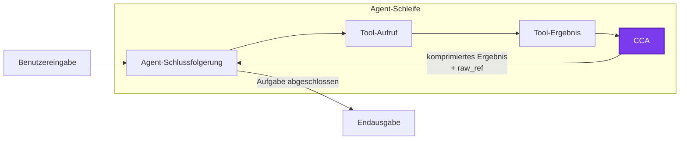
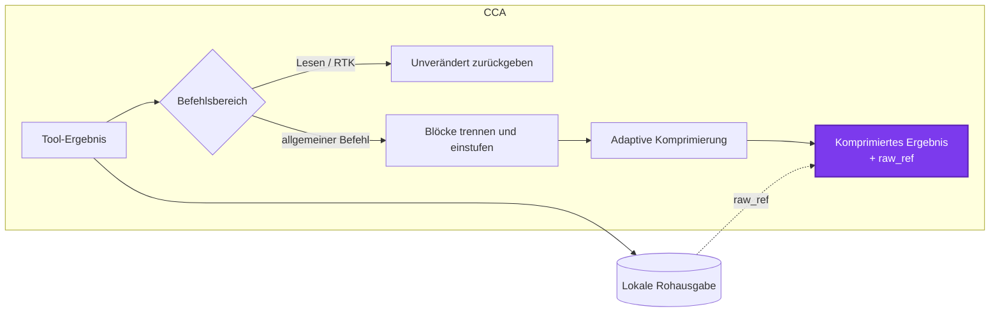

<p align="center"><strong>General command compressor that cuts every command output your Agent receives.</strong></p>

<p align="center">
  <a href="../README.md">English</a> ·
  <a href="README.zh-CN.md">简体中文</a> ·
  <a href="README.fr.md">Français</a> ·
  <strong>Deutsch</strong> ·
  <a href="README.pt.md">Português</a>
</p>

---

Command Compressor for Agent (`CCA`) spart Tokens mit Regeln, anstatt den Agent aufzufordern, „weniger Tokens zu verwenden“.

CCA unterstützt Claude Code, Codex, die stabile Version von OpenCode und Pi. Es ist mit [RTK](https://github.com/rtk-ai/rtk) kompatibel: RTK übernimmt häufige Befehle und optimiert deren Ausgabe, während CCA nach der Ausführung eines Befehls Informationen mit geringem Wert entfernt.

## 1. Zweck, Vorteile und Verwendung von CCA

Lange Build-Protokolle, Ausgaben von Paketinstallationen, Fortschrittsanzeigen und wiederholte Statuszeilen können einen großen Teil des Agent-Kontexts belegen, ohne zur Lösung der Aufgabe beizutragen. CCA komprimiert diese Bereiche mit geringem Wert und bewahrt dabei Fehler, Tracebacks, Quelltextpositionen, kodierte Daten, visuelle Diagnosen und andere Informationen, deren Entfernung riskant wäre.

CCA bleibt bewusst klein:

- **Zurückhaltend.** Es übernimmt keine Befehle und umschließt den Agent nicht; es komprimiert lediglich die Ausgabe nach Abschluss eines Befehls.
- **Lokal.** Keine Netzwerk- oder Modellaufrufe, Embeddings oder Laufzeit-Lernprozesse.
- **Wiederherstellbar.** Jedes veränderte Ergebnis besitzt eine lokale `raw_ref`; der Befehl muss nicht erneut ausgeführt werden, um ausgelassenen Text abzurufen.
- **Lesesicher und RTK-kompatibel.** Inspektionsbefehle, das Lesen der Rohausgabe und von RTK verwaltete Befehle werden unverändert durchgereicht.
- **Fail-open.** Wenn ein Adapter oder der Kompressor fehlschlägt, erhält der Agent das ursprüngliche Tool-Ergebnis.

### Installation

CCA benötigt Node.js 18 oder neuer.

```bash
npm install -g @linger-alpha/cca
cca init --global
```

`cca init` erkennt installierte unterstützte Agents und richtet alle passenden Integrationen ein. So installieren Sie nur eine Integration:

```bash
cca install --claude-code --global
cca install --codex --global
cca install --opencode --global
cca install --pi --global
```

Verwenden Sie `--project` anstelle von `--global`, um die Installation auf das aktuelle Repository zu beschränken.

```bash
cca status --json       # Erkennung, Installationspfade und Vertrauensstatus
cca gain                # lokal geschätzte Einsparungen
cca rules               # aktive, bearbeitbare Regeldatei
cca uninstall --global  # alle von CCA verwalteten globalen Integrationen entfernen
```

Codex verlangt, dass der Benutzer den Hook unter `/hooks` prüft; CCA umgeht diesen Vertrauensschritt nicht. Codex zeigt den Austausch nach einem Tool-Aufruf als blockiertes Hook-Feedback an, obwohl der Befehl bereits abgeschlossen ist. Deshalb teilt CCA dem Modell ausdrücklich mit, dass der Text ein komprimiertes Ergebnis und kein Befehlsfehler ist. OpenCode v2 Beta wird von dieser Version nicht unterstützt.

## 2. Funktionsweise von CCA

CCA befindet sich in der normalen Agent-Schleife zwischen der Befehlsausführung und der nächsten Modellrunde:



Innerhalb dieses CCA-Schritts:



Zunächst nimmt die Befehlsrichtlinie Inspektionsbefehle, das Abrufen der Rohausgabe und RTK-verwaltete Befehle von der Komprimierung aus. Bei anderen Befehlen gruppiert ein linearer, regelbasierter Splitter benachbarte Zeilen anhand von Leerbereichen, Zeitstempeln, Log-Stufen, Traceback-Zuständen, Einrückungen und Änderungen in Wiederholungsmustern. Er analysiert kein bestimmtes Test-Framework und fragt kein Modell nach der Bedeutung des Textes.

Jedem Block wird anschließend eine von drei Aktionen zugewiesen:

- **Bewahren:** Kodierte oder binär wirkende Daten, visuelle und semantisch dichte Ausgaben, Tracebacks, Fehler und wichtige Diagnosen verlustfrei erhalten.
- **Leicht:** Duplikate zusammenfassen und nützliche Anfangs-, End- und kritische Zeilen behalten.
- **Stark:** Fortschrittsrauschen entfernen und sich wiederholende Ausgaben mit geringem Informationswert stark zusammenfassen.

Abschließend ersetzt jeder Adapter das Tool-Ergebnis im plattformspezifischen Format. Der Agent sieht nur, dass das Ergebnis komprimiert wurde und wo das Original gespeichert ist; interne Bewertungen, Stufen und Regeldiagnosen werden nie in seinen Kontext aufgenommen. Claude Code verwendet `updatedToolOutput`, Codex blockiertes Post-Tool-Feedback, OpenCode aktualisiert `tool.execute.after`, und Pi ersetzt `tool_result.content`, wobei `details` und `isError` erhalten bleiben.

Die Regeln sind statische JSON-Dateien. Offline-Forschung nach dem Vorbild von TACO kann neue Kandidaten vorschlagen und bewerten, aber das npm-Paket enthält weder Trainingscode noch Modellabhängigkeiten.

## 3. Experimentelle Ergebnisse

### Versuchsaufbau

| Einstellung | Wert |
| --- | --- |
| Benchmark | `terminal-bench/terminal-bench-2-1@latest`, Aufgabenrevisionen per Prüfsumme festgehalten |
| Aufgaben | `build-cython-ext`, `pypi-server`, `sqlite-with-gcov`, `log-summary-date-ranges`, `regex-log`, `nginx-request-logging`, `extract-elf`, `sqlite-db-truncate`, `code-from-image` und `count-dataset-tokens` |
| Agent | Codex CLI über Harbor in isolierten Docker-Umgebungen pro Aufgabe |
| Modell | `gpt-5.6-luna`, Schlussfolgerungsaufwand `max` |
| Dynamische Gruppen | Ohne Komprimierung gegenüber CCA 0.2.0-rc.1 (`00e82fa`) |
| Wiederholungen | Vier je Aufgabe und Gruppe: 10 Aufgaben × 4 Wiederholungen × 2 Gruppen = 80 gültige Durchläufe |
| Reihenfolge | Randomisiert mit Seed `20260729`; der Seed steuert die Reihenfolge, nicht den Determinismus des Modells |
| Ausführung | Die ersten 37 gültigen Durchläufe liefen sequenziell; die übrigen 43 nach Prüfung der isolierten Zustandsaktualisierung mit zwei Workern |
| Wiederholungsrichtlinie | Drei durch vorübergehende EOF-Fehler eines apt-Spiegels betroffene Setup-Versuche wurden wiederholt und aus den 80 gültigen Ergebnissen ausgeschlossen |

Die folgenden End-to-End-Eingabetoken werden von Codex für die vollständige, veränderliche Agent-Trajektorie gemeldet. Die Tabellen mit fester Eingabe verwenden dagegen CCAs lokalen Token-Schätzer für aufgezeichnete Tool-Ergebnisse. Beide beantworten unterschiedliche Fragen und sollten nicht wie dieselbe Metrik verglichen werden.

### Gleiche Eingabe: Rohausgabe, 0.1.4 und 0.2.0

Der Vergleich mit fester Eingabe spielt alle 523 Tool-Ergebnisse aus den 40 Durchläufen ohne Komprimierung deterministisch als Rohausgabe, mit CCA 0.1.4 (`7830b17`) und mit den in rc.2 finalisierten Regeln von CCA 0.2.0 ab. Dadurch wird das Verhalten des Kompressors von Schwankungen der Agent-Trajektorie getrennt. Die Tokenzahlen sind lokale Schätzungen, keine Abrechnungsdaten des Modellanbieters.

| Kompressor | Geschätzte Tool-Ergebnis-Tokens | Reduktion gegenüber Rohdaten | Reduktion gegenüber 0.1.4 |
| --- | ---: | ---: | ---: |
| Ohne Komprimierung | 398.555 | — | — |
| CCA 0.1.4 | 373.320 | 6,33 % | — |
| CCA 0.2.0 | 343.646 | **13,78 %** | **7,95 %** |

Werden unveränderte Lese-, RTK- und Fallback-Ergebnisse ausgeschlossen, zeigen die 342 Ergebnisse allgemeiner Befehle den Unterschied deutlicher:

| Kompressor | Geschätzte Tokens | Reduktion gegenüber Rohdaten | Reduktion gegenüber 0.1.4 |
| --- | ---: | ---: | ---: |
| Ohne Komprimierung | 164.762 | — | — |
| CCA 0.1.4 | 153.366 | 6,92 % | — |
| CCA 0.2.0 | 109.853 | **33,33 %** | **28,37 %** |

Bei dieser Wiedergabe bewahrte rc.2 100 % der geprüften kritischen Fakten und 100 % der kodierten beziehungsweise geschützten Blöcke. Um diese Sicherheitsgrenze einzuhalten, komprimiert CCA bewusst nicht jede lange Ausgabe.

### Reale Agent-Schleife: 80 Terminal-Bench-2.1-Durchläufe

Zehn Aufgaben wurden je Gruppe viermal mit Codex CLI und `gpt-5.6-luna` bei maximalem Schlussfolgerungsaufwand ausgeführt: 40 Durchläufe ohne Komprimierung und 40 mit CCA rc.1.

| End-to-End-Messwert | Ohne Komprimierung | CCA |
| --- | ---: | ---: |
| Erfolgreiche Durchläufe | **34/40** | **33/40\*** |
| Median der Eingabetokens in den 32 übereinstimmenden Erfolgspaaren | 198.703,5 | 182.351,5 |
| Eingabereduktion in übereinstimmenden Erfolgspaaren | — | **8,23 %** |

Innerhalb der CCA-Gruppe wurden alle Tool-Ergebnisse zusammen um 9,62 % reduziert; die tatsächlich komprimierbare Teilmenge wurde um 22,04 % reduziert.

\*: Gegenüber der Gruppe ohne Komprimierung erzielte CCA einen zusätzlichen Erfolg und zwei zusätzliche Fehlschläge. Ein Fehlschlag wurde als unabhängig von der Komprimierung diagnostiziert; der andere zeigte, dass eine komprimierte `curl GET`-Ausgabe das Modell daran hinderte, README-Informationen abzurufen. Dieses Problem wurde in 0.2.0 behoben; der entsprechende Schutz wurde erstmals in rc.2 eingeführt. Der [vollständige Terminal-Bench-2.1-Versuchsbericht](../research/benchmark/tb21-10x4-rc1-analysis.md) enthält sämtliche Ergebnisse, abweichende Fälle, Einschränkungen und die Veröffentlichungsentscheidung.

## Trennung von Laufzeit und Forschung

Das npm-Paket enthält ausschließlich `bin/`, `src/`, `rules/` sowie die von npm automatisch aufgenommenen Paketmetadaten, README und Lizenz. Es besitzt keine Laufzeitabhängigkeiten von Drittanbietern und führt weder Netzwerk- noch Modellaufrufe aus.

Das GitHub-Repository enthält unter `research/` zusätzlich Importer, Werkzeuge zur Datenmaskierung, Prompts, Kandidatenerzeugung, unabhängige Bewertung, Replay-Analysen und Harbor-/Terminal-Bench-Werkzeuge. Der Produktionscode importiert oder untersucht dieses Verzeichnis nie. `npm run check:package` erzwingt diese Trennung.

Die bisherigen Stärkebezeichnungen `low`, `default`, `high` und `xhigh` werden weiterhin akzeptiert, haben aber keine Wirkung mehr.

## Community

Issues, reproduzierbare Traces und Regelvorschläge sind willkommen – insbesondere Fälle, in denen die Komprimierung den Aufgabenerfolg verändert oder ein unnötiges Lesen der Rohausgabe auslöst. Agent-Trajektorien können dem Autor ebenfalls zur Verfügung gestellt werden, um die Stabilität bei Randfällen und die Komprimierungsleistung zu verbessern.

Vielen Dank an die [LINUX DO](https://linux.do/)-Community für den Raum zum Austausch und Teilen des Projekts.

## Lizenz

MIT
