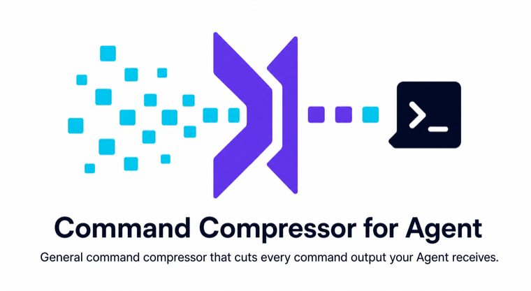
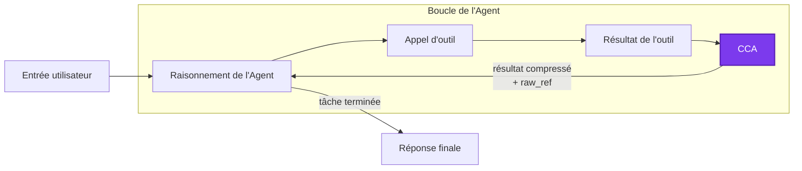
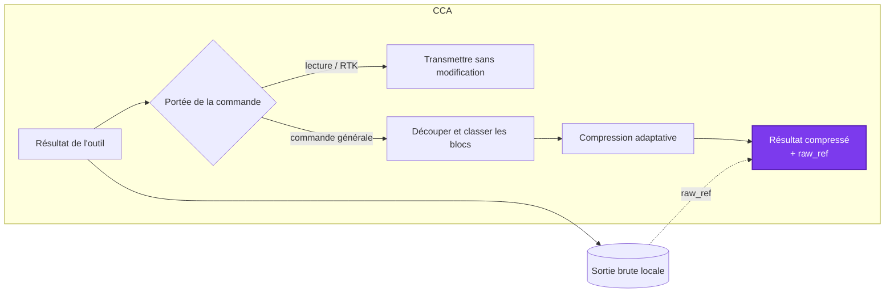

<p align="center"><strong>General command compressor that cuts every command output your Agent receives.</strong></p>

<p align="center">
  <a href="../README.md">English</a> ·
  <a href="README.zh-CN.md">简体中文</a> ·
  <strong>Français</strong> ·
  <a href="README.de.md">Deutsch</a> ·
  <a href="README.pt.md">Português</a>
</p>

---

Command Compressor for Agent (`CCA`) économise des tokens grâce à des règles, sans demander à l'Agent d'« utiliser moins de tokens ».

CCA prend en charge Claude Code, Codex, la version stable d'OpenCode et Pi. Il est compatible avec [RTK](https://github.com/rtk-ai/rtk) : RTK intercepte les commandes courantes et optimise leur sortie, tandis que CCA supprime les informations de faible valeur après l'exécution d'une commande.

## 1. Rôle, avantages et utilisation de CCA

Les longs journaux de compilation, les sorties d'installation de paquets, les barres de progression et les lignes d'état répétées peuvent occuper une grande partie du contexte d'un agent sans l'aider à résoudre sa tâche. CCA compresse ces zones de faible valeur tout en préservant les erreurs, les traces d'exécution, les emplacements dans le code source, les données encodées, les diagnostics visuels et les autres informations qu'il serait risqué de supprimer.

CCA reste volontairement minimal :

- **Mesuré.** Il n'intercepte pas les commandes et n'enveloppe pas l'Agent ; il compresse uniquement la sortie une fois la commande terminée.
- **Local.** Aucun appel réseau, appel de modèle, embedding ou apprentissage à l'exécution.
- **Récupérable.** Chaque résultat modifié possède une référence locale `raw_ref` ; il n'est pas nécessaire de relancer la commande pour retrouver le texte omis.
- **Sûr pour la lecture et compatible avec RTK.** Les commandes d'inspection, la lecture du résultat brut et les commandes gérées par RTK sont transmises sans modification.
- **Ouvert en cas d'échec.** Si un adaptateur ou le compresseur échoue, l'agent reçoit le résultat original de l'outil.

### Installation

CCA nécessite Node.js 18 ou une version ultérieure.

```bash
npm install -g @linger-alpha/cca
cca init --global
```

`cca init` détecte les agents compatibles installés et configure toutes les intégrations applicables. Pour n'en installer qu'une :

```bash
cca install --claude-code --global
cca install --codex --global
cca install --opencode --global
cca install --pi --global
```

Utilisez `--project` à la place de `--global` pour une installation limitée au dépôt courant.

```bash
cca status --json       # détection, chemins d'installation et état de confiance
cca gain                # estimation locale des économies
cca rules               # fichier de règles actif et modifiable
cca uninstall --global  # supprime toutes les intégrations globales gérées par CCA
```

Codex demande à l'utilisateur d'examiner son hook dans `/hooks` ; CCA ne contourne pas cette étape de confiance. Codex présente le remplacement post-outil comme un retour de hook bloqué alors que la commande s'est déjà terminée. CCA indique donc explicitement au modèle qu'il s'agit d'un résultat compressé et non d'un échec de la commande. OpenCode v2 bêta n'est pas pris en charge par cette version.

## 2. Fonctionnement de CCA

CCA se place dans la boucle normale de l'Agent, entre l'exécution de la commande et le prochain tour du modèle :



À l'intérieur de cette étape CCA :



La politique de commande exempte d'abord les commandes d'inspection, de récupération du résultat brut et celles gérées par RTK. Pour les autres commandes, un séparateur linéaire fondé sur des règles regroupe les lignes adjacentes selon les espaces vides, horodatages, niveaux de journalisation, états de traceback, indentations et changements de répétition. Il n'analyse aucun framework de test particulier et ne demande pas à un modèle d'interpréter le texte.

Chaque bloc reçoit ensuite l'une de ces trois actions :

- **Préserver :** conserver intégralement les données encodées ou d'apparence binaire, les sorties visuelles ou sémantiquement denses, les tracebacks, les échecs et les diagnostics importants.
- **Léger :** regrouper les doublons et conserver le début, la fin et les lignes critiques utiles.
- **Fort :** supprimer le bruit de progression et regrouper agressivement les sorties répétitives de faible valeur.

Enfin, chaque adaptateur reconvertit le résultat dans le format propre à la plateforme. L'Agent voit uniquement que le résultat a été compressé et où l'original est stocké ; les scores internes, niveaux et diagnostics des règles ne sont jamais ajoutés à son contexte.

## 3. Résultats expérimentaux

### Configuration de l'expérience

| Paramètre | Valeur |
| --- | --- |
| Benchmark | `terminal-bench/terminal-bench-2-1@latest`, avec les révisions des tâches enregistrées par somme de contrôle |
| Tâches | `build-cython-ext`, `pypi-server`, `sqlite-with-gcov`, `log-summary-date-ranges`, `regex-log`, `nginx-request-logging`, `extract-elf`, `sqlite-db-truncate`, `code-from-image` et `count-dataset-tokens` |
| Agent | Codex CLI |
| Modèle | `gpt-5.6-luna`, effort de raisonnement `max` |
| Répétitions | Quatre par tâche et par groupe : 10 tâches × 4 répétitions × 2 groupes = 80 essais valides |

Les nombres de tokens d'entrée de bout en bout ci-dessous sont rapportés par Codex sur la trajectoire complète et variable de l'Agent. Les tableaux à entrée fixe utilisent l'estimateur local de CCA sur les résultats d'outil capturés. Ces mesures répondent à des questions différentes et ne doivent pas être comparées comme s'il s'agissait de la même métrique.

### Entrée identique : sortie brute, 0.1.4 et 0.2.0

La comparaison à entrée fixe rejoue de manière déterministe les 523 résultats d'outil capturés lors des 40 essais sans compression : en sortie brute, avec CCA 0.1.4 (`7830b17`) et avec les règles finales de CCA 0.2.0. Elle isole ainsi le comportement du compresseur des variations de trajectoire de l'Agent. Les tokens sont des estimations locales et non des données de facturation du fournisseur.

| Compresseur | Estimation des tokens des résultats d'outil | Réduction par rapport au brut | Réduction par rapport à 0.1.4 |
| --- | ---: | ---: | ---: |
| Sans compression | 398 555 | — | — |
| CCA 0.1.4 | 373 320 | 6,33 % | — |
| CCA 0.2.0 | 343 646 | **13,78 %** | **7,95 %** |

Après exclusion des transmissions directes pour la lecture, RTK et le fallback, les 342 résultats de commandes générales montrent plus clairement la différence :

| Compresseur | Estimation des tokens | Réduction par rapport au brut | Réduction par rapport à 0.1.4 |
| --- | ---: | ---: | ---: |
| Sans compression | 164 762 | — | — |
| CCA 0.1.4 | 153 366 | 6,92 % | — |
| CCA 0.2.0 | 109 853 | **33,33 %** | **28,37 %** |

Lors de ce rejeu, CCA 0.2.0 a conservé 100 % des faits critiques audités et 100 % des blocs encodés ou protégés. C'est pour maintenir cette limite de sécurité que CCA ne compresse volontairement pas toutes les sorties longues.

### Boucle réelle de l'Agent : 80 essais Terminal-Bench 2.1

Dix tâches ont été exécutées quatre fois par groupe avec Codex CLI et `gpt-5.6-luna` au niveau de raisonnement maximal : 40 essais sans compression et 40 avec CCA.

| Mesure de bout en bout | Sans compression | CCA |
| --- | ---: | ---: |
| Essais réussis | **34/40** | **33/40\*** |
| Médiane des tokens d'entrée sur les 32 paires de réussites correspondantes | 198 703,5 | 182 351,5 |
| Réduction des tokens d'entrée sur les réussites correspondantes | — | **8,23 %** |

Dans le groupe CCA, l'ensemble des résultats d'outil a été réduit de 9,62 % au total, tandis que le sous-ensemble réellement admissible à la compression a été réduit de 22,04 %.

\* : par rapport au groupe sans compression, CCA a produit une réussite supplémentaire et deux échecs supplémentaires. Un échec a été diagnostiqué comme indépendant de la compression ; l'autre a révélé que la compression d'une sortie `curl GET` empêchait le modèle d'obtenir des informations du README. Ce problème a été corrigé dans la version 0.2.0. Consultez le [rapport complet de l'expérience Terminal-Bench 2.1](../research/benchmark/tb21-10x4-analysis.md) pour les résultats, les cas divergents, les limites et la décision de publication.

## Séparation entre exécution et recherche

Le paquet npm contient uniquement `bin/`, `src/`, `rules/` ainsi que les métadonnées automatiques de npm, le README et la licence. Il ne possède aucune dépendance d'exécution tierce et n'effectue aucun appel réseau ou appel de modèle.

Le dépôt GitHub contient en plus, sous `research/`, les outils d'importation, de masquage des données, les prompts, la génération de candidats, l'évaluation indépendante, l'analyse par rejeu et les outils Harbor/Terminal-Bench. Le code de production n'importe ni n'inspecte jamais ce répertoire. `npm run check:package` vérifie cette séparation.

Les anciens noms de niveaux `low`, `default`, `high` et `xhigh` restent acceptés, mais n'ont plus aucun effet.

## Communauté

Les issues, traces reproductibles et propositions de règles sont les bienvenues, en particulier lorsque la compression modifie la réussite d'une tâche ou provoque une lecture inutile du résultat brut. Des trajectoires d'Agent peuvent également être transmises à l'auteur afin d'améliorer la stabilité sur les cas limites et les performances de compression.

Merci à la communauté [LINUX DO](https://linux.do/) d'offrir un espace d'échange et de partage autour du projet.

## Licence

MIT
