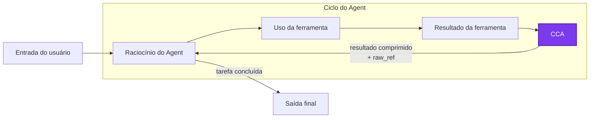
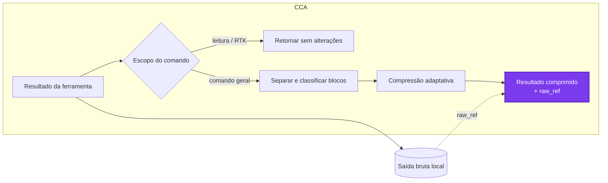

<p align="center"><strong>General command compressor that cuts every command output your Agent receives.</strong></p>

<p align="center">
  <a href="../README.md">English</a> ·
  <a href="README.zh-CN.md">简体中文</a> ·
  <a href="README.fr.md">Français</a> ·
  <a href="README.de.md">Deutsch</a> ·
  <strong>Português</strong>
</p>

---

Command Compressor for Agent (`CCA`) economiza tokens por meio de regras, em vez de pedir ao Agent para “usar menos tokens”.

O CCA oferece suporte ao Claude Code, Codex, à versão estável do OpenCode e ao Pi. Ele é compatível com o [RTK](https://github.com/rtk-ai/rtk): o RTK assume comandos comuns e otimiza suas saídas, enquanto o CCA remove informações de baixo valor depois que um comando é executado.

## 1. O que o CCA faz, vantagens e uso

Logs extensos de compilação, saídas de instalação de pacotes, barras de progresso e linhas de status repetidas podem consumir grande parte do contexto de um agente sem ajudá-lo a resolver a tarefa. O CCA comprime essas regiões de baixo valor e preserva erros, tracebacks, localizações no código-fonte, dados codificados, diagnósticos visuais e outras informações que não podem ser removidas com segurança.

O CCA é deliberadamente pequeno:

- **Contido.** Não assume comandos nem envolve o Agent; apenas comprime a saída depois que o comando termina.
- **Local.** Sem chamadas de rede, chamadas de modelo, embeddings ou aprendizagem em tempo de execução.
- **Recuperável.** Todo resultado alterado possui uma referência local `raw_ref`; não é necessário executar novamente o comando para recuperar o texto omitido.
- **Seguro para leitura e compatível com RTK.** Comandos de inspeção, leitura da saída bruta e comandos geridos pelo RTK passam sem alterações.
- **Fail-open.** Se um adaptador ou o compressor falhar, o agente recebe o resultado original da ferramenta.

### Instalação

O CCA requer Node.js 18 ou posterior.

```bash
npm install -g @linger-alpha/cca
cca init --global
```

`cca init` detecta os agentes compatíveis instalados e configura todas as integrações aplicáveis. Para instalar apenas uma integração:

```bash
cca install --claude-code --global
cca install --codex --global
cca install --opencode --global
cca install --pi --global
```

Use `--project` no lugar de `--global` para uma instalação limitada ao repositório atual.

```bash
cca status --json       # detecção, caminhos de instalação e estado de confiança
cca gain                # estimativa local da economia
cca rules               # arquivo de regras ativo e editável
cca uninstall --global  # remove todas as integrações globais geridas pelo CCA
```

O Codex exige que o usuário reveja o hook em `/hooks`; o CCA não contorna essa etapa de confiança. O Codex apresenta a substituição posterior à ferramenta como feedback de hook bloqueado, embora o comando já tenha terminado. Por isso, o CCA informa explicitamente ao modelo que o texto é um resultado comprimido, e não uma falha do comando. O OpenCode v2 beta não é compatível com esta versão.

## 2. Como o CCA funciona

O CCA fica dentro do ciclo normal do Agent, entre a execução do comando e o turno seguinte do modelo:



Dentro dessa etapa do CCA:



Primeiro, a política de comandos isenta comandos de inspeção, recuperação da saída bruta e comandos geridos pelo RTK. Para os demais, um separador linear baseado em regras agrupa linhas adjacentes usando regiões vazias, carimbos de data e hora, níveis de log, estado de traceback, indentação e mudanças nos padrões de repetição. Ele não analisa nenhum framework de testes específico nem pergunta a um modelo o significado do texto.

Cada bloco recebe então uma de três ações:

- **Preservar:** manter integralmente dados codificados ou com aparência binária, saídas visuais e semanticamente densas, tracebacks, falhas e diagnósticos importantes.
- **Leve:** agrupar duplicações e conservar o início, o fim e as linhas críticas úteis.
- **Forte:** remover ruído de progresso e condensar agressivamente saídas repetitivas de pouca informação.

Por fim, cada adaptador substitui o resultado no formato específico da plataforma. O agente vê apenas que o resultado foi comprimido e onde o original está armazenado; pontuações internas, níveis e diagnósticos das regras nunca são adicionados ao contexto. O Claude Code usa `updatedToolOutput`, o Codex usa feedback bloqueado após a ferramenta, o OpenCode atualiza `tool.execute.after`, e o Pi substitui `tool_result.content` preservando `details` e `isError`.

As regras são arquivos JSON estáticos. A investigação offline inspirada no TACO pode propor e avaliar novos candidatos, mas nenhum código de treino ou dependência de modelo é incluído no pacote npm.

## 3. Resultados experimentais

### Configuração do experimento

| Configuração | Valor |
| --- | --- |
| Benchmark | `terminal-bench/terminal-bench-2-1@latest`, com as revisões das tarefas registadas por checksum |
| Tarefas | `build-cython-ext`, `pypi-server`, `sqlite-with-gcov`, `log-summary-date-ranges`, `regex-log`, `nginx-request-logging`, `extract-elf`, `sqlite-db-truncate`, `code-from-image` e `count-dataset-tokens` |
| Agent | Codex CLI executado pelo Harbor em ambientes Docker isolados por tarefa |
| Modelo | `gpt-5.6-luna`, esforço de raciocínio `max` |
| Grupos dinâmicos | Sem compressão contra CCA 0.2.0-rc.1 (`00e82fa`) |
| Repetições | Quatro por tarefa e grupo: 10 tarefas × 4 repetições × 2 grupos = 80 ensaios válidos |
| Ordem dos ensaios | Aleatória com a semente `20260729`; a semente controla a ordem, não o determinismo do modelo |
| Execução | Os primeiros 37 ensaios válidos foram executados sequencialmente; os 43 restantes usaram dois workers após a validação das atualizações de estado isoladas |
| Política de repetição | Três tentativas de configuração afetadas por erros EOF temporários do espelho apt foram repetidas e excluídas dos 80 resultados válidos |

As contagens de tokens de entrada de ponta a ponta abaixo são informadas pelo Codex sobre a trajetória completa e variável do Agent. Já as tabelas de entrada fixa usam o estimador local de tokens do CCA nos resultados de ferramentas capturados. Elas respondem a perguntas diferentes e não devem ser comparadas como se fossem a mesma métrica.

### Mesma entrada: saída bruta, 0.1.4 e 0.2.0

A comparação de entrada fixa reproduz deterministicamente todos os 523 resultados de ferramentas capturados nos 40 ensaios sem compressão: como saída bruta, pelo CCA 0.1.4 (`7830b17`) e pelas regras do CCA 0.2.0 finalizadas na rc.2. Isso isola o comportamento do compressor da variação na trajetória do Agent. As contagens são estimativas locais, não dados de faturação do fornecedor do modelo.

| Compressor | Tokens estimados dos resultados de ferramentas | Redução em relação ao bruto | Redução em relação à 0.1.4 |
| --- | ---: | ---: | ---: |
| Sem compressão | 398.555 | — | — |
| CCA 0.1.4 | 373.320 | 6,33% | — |
| CCA 0.2.0 | 343.646 | **13,78%** | **7,95%** |

Quando são excluídos os resultados de leitura, RTK e fallback que passam sem alterações, os 342 resultados de comandos gerais mostram a diferença com mais clareza:

| Compressor | Tokens estimados | Redução em relação ao bruto | Redução em relação à 0.1.4 |
| --- | ---: | ---: | ---: |
| Sem compressão | 164.762 | — | — |
| CCA 0.1.4 | 153.366 | 6,92% | — |
| CCA 0.2.0 | 109.853 | **33,33%** | **28,37%** |

Nessa reprodução, a rc.2 preservou 100% dos fatos críticos auditados e 100% dos blocos codificados ou protegidos. É para manter esse limite de segurança que o CCA não comprime deliberadamente toda saída extensa.

### Ciclo real do Agent: 80 ensaios do Terminal-Bench 2.1

Dez tarefas foram executadas quatro vezes por grupo com Codex CLI e `gpt-5.6-luna` no nível máximo de raciocínio: 40 ensaios sem compressão e 40 com CCA rc.1.

| Medida de ponta a ponta | Sem compressão | CCA |
| --- | ---: | ---: |
| Ensaios bem-sucedidos | **34/40** | **33/40\*** |
| Mediana dos tokens de entrada nos 32 pares de sucesso correspondentes | 198.703,5 | 182.351,5 |
| Redução da entrada nos pares de sucesso correspondentes | — | **8,23%** |

No grupo CCA, o conjunto de todos os resultados de ferramentas foi reduzido em 9,62%, enquanto o subconjunto realmente elegível para compressão foi reduzido em 22,04%.

\*: Em comparação com o grupo sem compressão, o CCA produziu um sucesso adicional e duas falhas adicionais. Uma falha foi diagnosticada como não relacionada à compressão; a outra revelou que a compressão da saída de `curl GET` impedia o modelo de obter informações do README. Esse problema foi corrigido na versão 0.2.0, e a proteção foi introduzida pela primeira vez na rc.2. Consulte o [relatório completo do experimento Terminal-Bench 2.1](../research/benchmark/tb21-10x4-rc1-analysis.md) para ver todos os resultados, casos divergentes, limitações e a decisão de lançamento.

## Limite entre execução e investigação

O pacote npm contém apenas `bin/`, `src/`, `rules/` e os metadados automáticos do pacote npm, o README e a licença. Ele não possui dependências de execução de terceiros e não realiza chamadas de rede ou de modelos.

O repositório GitHub contém adicionalmente, em `research/`, importadores, ferramentas de remoção de dados sensíveis, prompts, geração de candidatos, avaliação independente, análise por reprodução e ferramentas do Harbor/Terminal-Bench. O código de produção nunca importa nem inspeciona esse diretório. `npm run check:package` garante essa separação.

Os nomes legados de intensidade `low`, `default`, `high` e `xhigh` continuam aceitos, mas já não têm efeito.

## Comunidade

Issues, traces reproduzíveis e propostas de regras são bem-vindos — especialmente casos em que a compressão altera o sucesso da tarefa ou provoca uma leitura desnecessária da saída bruta. Trajetórias de Agent também podem ser enviadas ao autor para melhorar a estabilidade em casos extremos e o desempenho da compressão.

Agradecemos à comunidade [LINUX DO](https://linux.do/) por oferecer um espaço para comunicar e partilhar o projeto.

## Licença

MIT
