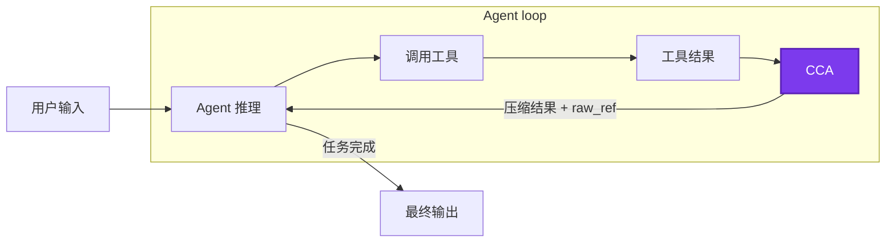
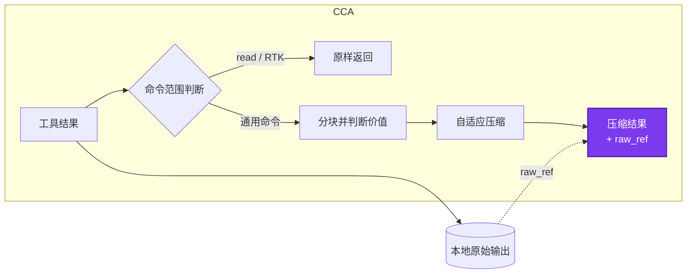

# Command Compressor for Agent

Command Compressor for Agent（`CCA`）致力于节省你的 token，通过规则而不是跟 Agent 说帮我省点 token。

CCA 支持 Claude Code、Codex、OpenCode 稳定版和 Pi。它兼容 [RTK](https://github.com/rtk-ai/rtk)：RTK 通过接管常见命令并优化它们的输出达到效果，CCA 则在命令执行后压缩输出的无效信息。

English documentation: [README.md](../README.md).

## 1. CCA 的作用、优势与使用

构建日志、依赖安装输出、进度条和重复状态行可能占用大量上下文，却很少帮助 agent 完成任务。CCA 会强力压缩这些低价值区域，同时保护错误、traceback、源码位置、编码数据、视觉诊断和其他不能安全删减的信息。

CCA 有意保持简单：

- **克制：** 不接管命令，不做 Agent warp，只在命令完成后压缩它的输出。
- **本地：** 不联网、不调用模型、不使用 embedding，也不在运行时训练。
- **可以恢复原文：** 每个被替换的结果都有本地 `raw_ref`，恢复信息无需重跑命令。
- **保护查阅命令并兼容 RTK：** read、raw fallback 和 RTK 管理的命令直接放行。
- **异常时放行：** adapter 或 compressor 出错时，agent 会收到原始 Tool Result。

### 安装

CCA 需要 Node.js 18 或更高版本。

```bash
npm install -g @linger-alpha/cca
cca init --global
```

`cca init` 会检测本机已经安装的受支持 agent，并为它们安装相应集成。也可以只安装一个：

```bash
cca install --claude-code --global
cca install --codex --global
cca install --opencode --global
cca install --pi --global
```

如果只希望在当前仓库安装，把 `--global` 改成 `--project`。

```bash
cca status --json       # 检测结果、安装路径和信任状态
cca gain                # 本地估算节省量
cca rules               # 当前可编辑规则文件
cca uninstall --global  # 卸载所有由 CCA 管理的全局集成
```

Codex 安装后需要用户在 `/hooks` 中审核，CCA 不会绕过信任步骤。Codex 会把 post-tool 替换显示成 blocked hook feedback，尽管原命令已经成功执行；因此 CCA 会明确告诉模型这是压缩后的结果，而不是命令执行失败。当前版本不支持 OpenCode v2 beta。

## 2. CCA 的原理

CCA 位于正常 Agent loop 中的“命令执行”和“模型下一轮推理”之间：



这个 CCA 节点内部的简化流程如下：



首先，命令策略会放行查阅命令、raw fallback 和由 RTK 管理的命令。其他输出由一个线性规则 Splitter 按空白区域、时间戳、日志级别、traceback 状态、缩进和重复模式变化分成较粗的块。它不会解析某个具体测试框架，也不会调用模型理解文本。

每个块随后进入三个处理档位之一：

- **保留：** 对编码或疑似二进制数据、视觉和密集语义输出、traceback、失败信息和高价值诊断进行无损保留。
- **轻压缩：** 折叠重复内容，并保留有用的头部、尾部和关键行。
- **强压缩：** 清除进度噪声，强力折叠重复、低信息量输出。

最后，各 Agent adapter 把结果转换回平台格式。Agent 只会看到“结果已压缩”和原文位置，不会看到内部评分、档位或规则诊断。Claude Code 使用 `updatedToolOutput`；Codex 使用 post-tool blocked feedback；OpenCode 修改 `tool.execute.after`；Pi 替换 `tool_result.content` 并保留 `details` 和 `isError`。

生产规则是静态 JSON。仓库内的 TACO 风格离线研究流程可以生成和评判候选规则，但训练代码和模型依赖不会进入 npm 包。

## 3. 实验数据

### 实验设置

| 设置 | 内容 |
| --- | --- |
| Benchmark | `terminal-bench/terminal-bench-2-1@latest`，并记录每道题的 revision checksum |
| 任务 | `build-cython-ext`、`pypi-server`、`sqlite-with-gcov`、`log-summary-date-ranges`、`regex-log`、`nginx-request-logging`、`extract-elf`、`sqlite-db-truncate`、`code-from-image`、`count-dataset-tokens` |
| Agent | Codex CLI，通过 Harbor 在相互隔离的 Docker 任务环境中运行 |
| 模型 | `gpt-5.6-luna`，`max` reasoning effort |
| 动态实验组 | 不压缩 vs CCA 0.2.0-rc.1（`00e82fa`） |
| 重复次数 | 每道题、每组各四次：10 个任务 × 4 次 × 2 组，共 80 次有效实验 |
| 实验顺序 | 使用种子 `20260729` 随机排列；该种子只控制运行顺序，不代表模型输出是确定性的 |
| 执行方式 | 前 37 次有效实验串行执行；验证隔离状态更新后，剩余 43 次使用两个 worker |
| 重试规则 | 三次实验准备阶段遇到临时 apt 镜像 EOF，重试成功；这些失败不计入 80 次有效任务结果 |

下文的端到端输入 token 由 Codex 对完整且不断变化的 Agent 轨迹报告；固定输入表格则使用 CCA 的本地 token 估算器统计捕获的 Tool Result。两者回答的问题不同，不能当作同一个指标直接比较。

### 固定输入：原始输出、0.1.4 与 0.2.0-rc.2

固定输入对比使用 40 次无压缩实验捕获的全部 523 条 Tool Result，分别按原始输出、CCA 0.1.4（`7830b17`）和实验后修正的 0.2.0-rc.2 规则进行确定性回放。这样可以排除 Agent 轨迹变化，只比较压缩器本身。下列 token 是本地估算值，不是模型供应商的账单数据。

| 压缩器 | Tool Result 估算 token | 相对原始输出 | 相对 0.1.4 |
| --- | ---: | ---: | ---: |
| 不压缩 | 398,555 | — | — |
| CCA 0.1.4 | 373,320 | 减少 6.33% | — |
| CCA 0.2.0-rc.2 | 343,646 | **减少 13.78%** | **减少 7.95%** |

排除 read、RTK 和 fallback 等按设计放行的结果后，342 条通用命令更能体现压缩核心的差异：

| 压缩器 | 估算 token | 相对原始输出 | 相对 0.1.4 |
| --- | ---: | ---: | ---: |
| 不压缩 | 164,762 | — | — |
| CCA 0.1.4 | 153,366 | 减少 6.92% | — |
| CCA 0.2.0-rc.2 | 109,853 | **减少 33.33%** | **减少 28.37%** |

rc.2 在这次回放中保留了 100% 的审计关键事实和 100% 的编码/受保护块。CCA 有意不压缩所有长输出，正是为了维持这条安全边界。

### 真实 Agent loop：80 次 Terminal-Bench 2.1 实验

实验选择十个任务，每组各重复四次，使用 Codex CLI 和 max reasoning 的 `gpt-5.6-luna`：无压缩 40 次，CCA rc.1 40 次。

| 端到端指标 | 不压缩 | CCA |
| --- | ---: | ---: |
| 通过次数 | **34/40** | **33/40** |
| 32 对双方均通过实验的输入 token 中位数 | 198,703.5 | 182,351.5 |
| 匹配成功实验的输入 token 降幅 | — | **8.23%** |

CCA 组全部 Tool Result 的总降幅为 9.62%，其中真正允许压缩的输出下降 22.04%。40 次 CCA 实验均未读取 `raw_ref`。通过数少一次仍在预发布质量容差内，但这组结果不能证明 CCA 会提高任务成功率：Agent 轨迹存在随机变化，而且实验没有达到预设的端到端输入 token 降低 10% 目标。

动态实验使用 rc.1。实验暴露的问题促成了 rc.2 对“复合源码查阅”和“仅输出到 stdout 的安全 HTTP GET”的保护。修复已经通过固定输入回放、完整回归测试、Node 18 容器测试、npm 包审计和四种 adapter 的真实安装 smoke test，但尚未用 rc.2 重新跑完整的 80 次动态实验。

完整结果、差异案例、局限和发布判断见 [Terminal-Bench 2.1 实验报告](../research/benchmark/tb21-10x4-rc1-analysis.md)。

## 生产包与研究代码的边界

npm 包只包含 `bin/`、`src/`、`rules/` 以及 npm 自动加入的 package metadata、README 和 license。它没有第三方运行时依赖，也不会联网或调用模型。

GitHub 仓库还在 `research/` 下开源了导入、脱敏、prompt、候选生成、独立评判、回放分析和 Harbor/Terminal-Bench 工具。生产代码不会导入或探测该目录，`npm run check:package` 会检查这一边界。

旧的 `low`、`default`、`high` 和 `xhigh` 名称仍可使用，以兼容已有配置。在新的分块管线中，它们不再选择全局 token budget 或不同规则集；压缩强度由每个块自身的策略决定。

## 社区

欢迎提交 issue、可复现轨迹和规则建议，尤其是压缩改变任务结果或触发不必要 fallback 的案例，欢迎给作者提交 Agent 运行轨迹用于改进边缘情况稳定性与提高压缩性能。

感谢 [LINUX DO](https://linux.do/) 社区提供交流与分享平台。

## License

MIT
